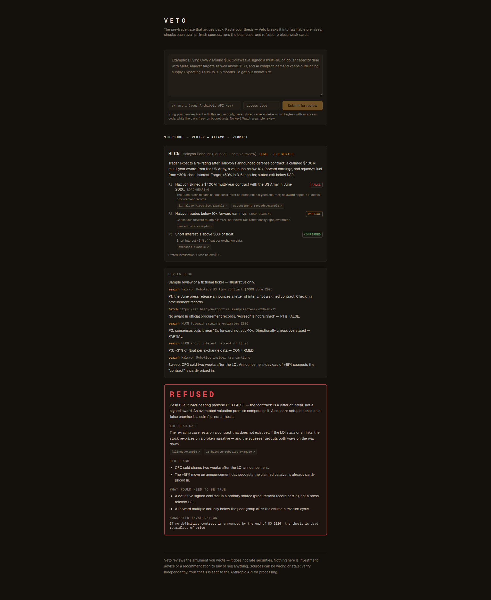

# Veto

**The pre-trade gate that argues back.**

Paste your investment thesis. Veto structures it into a trade card, decomposes it into falsifiable premises, verifies each one against fresh sources, runs the bear case — and refuses to bless weak cards.

Trading journals analyze your trades after the fact. Veto attacks them **before you buy** — because the cheapest loss is the one you never take.



**Live:** [veto-production.up.railway.app](https://veto-production.up.railway.app) — watch the sample review without a key, or bring your own Anthropic key for a real one.

## How it works

1. **Structure** — your freeform thesis becomes a trade card: ticker, direction, horizon, and the falsifiable premises your argument actually depends on. If the thesis is too thin to review — no identifiable security, or no checkable reason at all — the desk asks two or three pointed questions first and folds your answers in (or reviews it as written, your call).
2. **Verify** — every premise is checked against fresh web sources and classified: `CONFIRMED` / `PARTIAL` / `FALSE` / `UNVERIFIABLE`, with clickable links to the sources the desk actually used. "Confirmed from memory" doesn't exist at this desk.
3. **Attack** — the adversarial sweep runs even when premises hold: strongest bear case, insider selling, dilution, short interest, valuation, and whether your catalyst is already priced in.
4. **Verdict** — `BLESSED` or `REFUSED`. A false load-bearing premise is an automatic refusal. When in doubt, it refuses. And no blessing ships untested: before delivering a `BLESSED`, the desk attacks its own verdict once — hunting disconfirming evidence against the premises it just confirmed — and the blessing is upheld or withdrawn on what the attack finds.
5. **Argue back** — disagree? Bring a new fact and contest the verdict. The desk verifies your claim against fresh sources and defends or amends — on evidence, never on insistence. The conversation lives in your browser; nothing is stored server-side.
6. **Local history** — finished reviews are saved in your browser (localStorage — no accounts, nothing server-side). Reopen a past review, contest it again, and track open invalidations: every verdict names the condition that should kill the trade, and re-checking it against fresh sources is one click — or re-check them all at once. Back up the whole history to a JSON file and import it into another browser — still no accounts.
7. **Export** — copy the whole review as Markdown for your journal, or download the verdict as a PNG card. Both artifacts carry their date, a sample marker when it's the demo, and the disclaimer — they travel honestly.

## What it is not

Veto judges **the argument, never the asset**. It produces no buy/sell/hold opinions, no price targets, no recommendations. A refused card means "this argument doesn't survive scrutiny," not "this stock will fall." Nothing here is investment advice.

## Run it

```bash
pnpm install
cp .env.example .env.local   # optional — only needed for the server-key free tier
pnpm dev
```

Open http://localhost:3000, paste a thesis, paste your Anthropic API key, submit.

Or smoke-test the API directly and watch the events stream:

```bash
curl -N -X POST http://localhost:3000/api/refute \
  -H "Content-Type: application/json" \
  -H "x-anthropic-api-key: sk-ant-..." \
  -d '{"thesis":"Buying CRWV around $87. CoreWeave signed a multi-billion dollar capacity deal with Meta, analyst targets sit well above $130, and AI compute demand keeps outrunning supply. Expecting +40% in 3-6 months. Out below $78."}'
```

**Bring your own key.** Your key is sent per-request in a header, used server-side for that request only, and never stored or logged. Alternatively, set `ANTHROPIC_API_KEY` in the environment to offer visitors a limited number of free runs per day (`FREE_RUNS_PER_DAY`, default 3).

Built with Next.js and the Claude API (`claude-opus-4-8` with server-side web search and web fetch). One review makes a handful of model calls and up to ~13 web operations; with your own key, expect a cost in the tens of cents per review.

## Origin

Veto is the productized core of a personal investment operating system: written trade cards, premise verification against second sources, and default-to-protection rules — run with real money, losses included. The engine's central rule exists because three of my own confidently-stated premises turned out to be false when actually checked. This tool is that lesson, automated.

The devlog walks through the thinking:

- [001 — I built a machine that refuses to approve my trades](docs/devlog/001-the-machine-that-argues-back.md)
- [002 — a verdict you can argue with](docs/devlog/002-a-verdict-you-can-argue-with.md)

## Roadmap

The verdict is now contestable (argue back), self-doubting (it attacks its own blessings), gated (it asks before reviewing a thin thesis), and durable (local history, open-invalidation tracking, markdown/PNG export). Anything further waits on real use: an append-only trade ledger, a process scoreboard (measure the process, not the picks), broker CSV import.

## License

MIT
